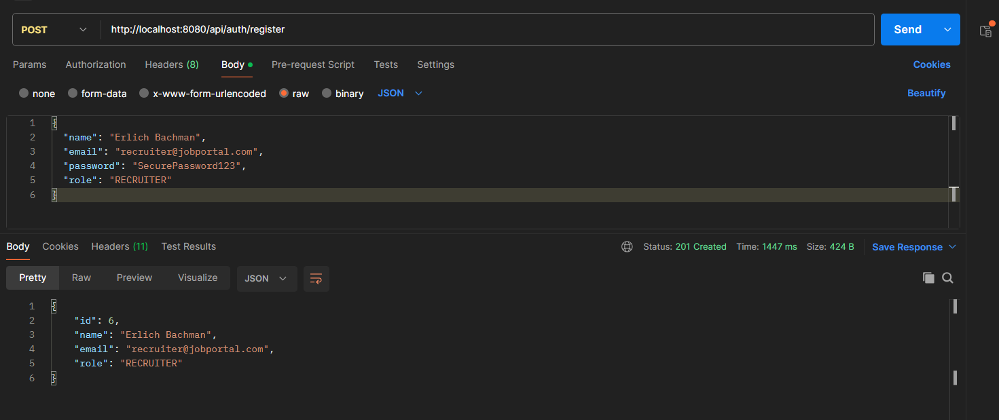
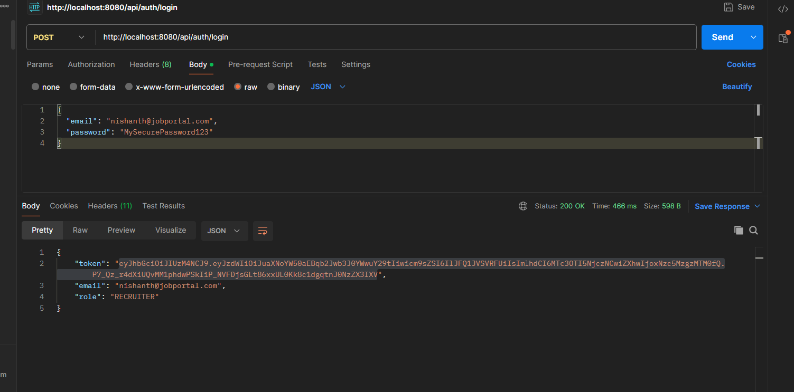
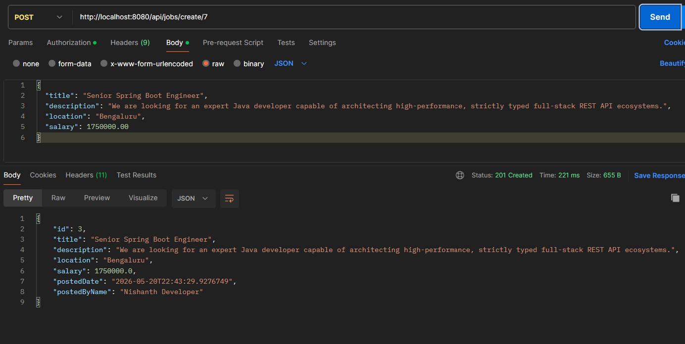
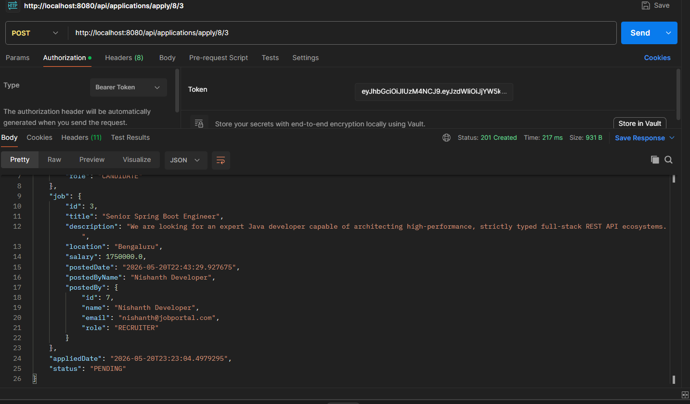
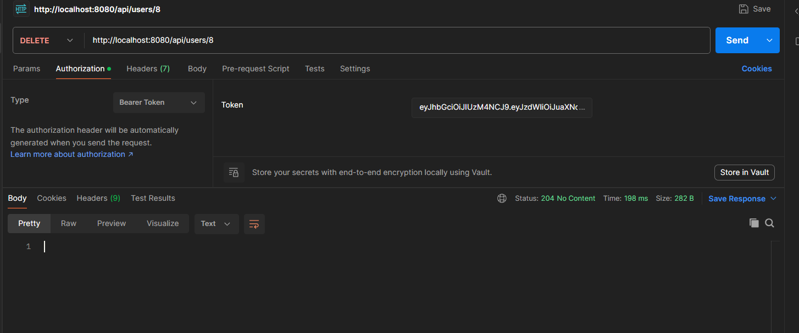

# 🚀 Smart Job Portal – Backend

A secure backend REST API for a recruitment platform where recruiters can post jobs and candidates can apply for them.

Built using **Java 17**, **Spring Boot 3**, **Spring Security**, and **SQL Server**.

---

## 📌 Project Overview

This project builds a real-world backend system that manages:

- 👤 Users & Authentication
- 💼 Job Postings
- 📝 Job Applications

### 🔄 Application Flow

Candidate registers → Login & gets JWT token → Recruiter posts job → Candidate applies → Application stored in database

---

## ✨ Features

### 🔐 Authentication & Security
- JWT based authentication (Login / Register)
- BCrypt password encryption
- Custom JWT filter for token validation on every request
- Stateless session management with Spring Security

### 👤 User Module
- User registration with role assignment (CANDIDATE / RECRUITER / ADMIN)
- Login and JWT token generation
- Role-Based Access Control (RBAC) using Java Enums

### 💼 Job Module
- Create job posting (Recruiter)
- View all jobs
- Search jobs by title and location

### 📝 Application Module
- Candidate can apply for a job
- View all applications

### ⚠️ Exception Handling
- Global Exception Handling using @ControllerAdvice
- Clean error responses for duplicate email, unauthorized access, invalid token

---

## 🛠 Tech Stack

| Technology | Usage |
|---|---|
| Java 17 | Core language |
| Spring Boot 3 | Backend framework |
| Spring Security | Authentication & Authorization |
| JWT (JSON Web Token) | Stateless authentication |
| Spring Data JPA | ORM / Database operations |
| SQL Server (T-SQL) | Database |
| BCrypt | Password encryption |
| Maven | Build tool |
| Postman | API testing |

---

## 🏗 Architecture

```text
Controller → Service → Repository → Database
```

### 📂 Project Structure

```text
src/main/java/com/nishanth/jobportal
├── config
│   └── SecurityConfig.java
├── controller
│   ├── AuthController.java
│   ├── JobController.java
│   └── ApplicationController.java
├── entity
│   ├── User.java
│   ├── Job.java
│   └── Application.java
├── repository
│   ├── UserRepository.java
│   ├── JobRepository.java
│   └── ApplicationRepository.java
├── service
│   ├── AuthService.java
│   ├── JobService.java
│   └── ApplicationService.java
├── security
│   ├── JwtUtil.java
│   └── JwtAuthenticationFilter.java
├── exception
│   └── GlobalExceptionHandler.java
└── JobportalApplication.java
```

---

## 🗄 Database Design

### 👤 users
| Column | Description |
|---|---|
| id | Primary key |
| name | User name |
| email | Email address (unique) |
| password | BCrypt encrypted password |
| role | CANDIDATE / RECRUITER / ADMIN |

### 💼 jobs
| Column | Description |
|---|---|
| id | Primary key |
| title | Job title |
| company | Company name |
| location | Job location |
| salary | Salary |
| description | Job description |
| posted_date | Job posted date |

### 📝 applications
| Column | Description |
|---|---|
| id | Primary key |
| user_id | Candidate id |
| job_id | Job id |
| applied_date | Applied date |
| status | APPLIED / REVIEWED / REJECTED |

---

## 🔗 API Endpoints

### 🔐 Auth
| Method | Endpoint | Description |
|---|---|---|
| POST | /auth/register | Register new user |
| POST | /auth/login | Login and get JWT token |

### 💼 Jobs
| Method | Endpoint | Description |
|---|---|---|
| POST | /jobs | Create job (Recruiter) |
| GET | /jobs | Get all jobs |
| GET | /jobs?title=Java&location=Bangalore | Search jobs |

### 📝 Applications
| Method | Endpoint | Description |
|---|---|---|
| POST | /applications | Apply for job |
| GET | /applications | Get all applications |

---

## 📬 Sample Requests

### Register
```json
POST /auth/register
{
  "name": "Nishanth",
  "email": "nishanth@gmail.com",
  "password": "secure123",
  "role": "CANDIDATE"
}
```

### Login
```json
POST /auth/login
{
  "email": "nishanth@gmail.com",
  "password": "secure123"
}
```

### Response
```json
{
  "token": "eyJhbGciOiJIUzI1NiJ9..."
}
```

### Create Job (use token in header)
```json
POST /jobs
Authorization: Bearer <token>
{
  "title": "Java Developer",
  "company": "TCS",
  "location": "Bangalore",
  "salary": 50000,
  "description": "Spring Boot Developer needed"
}
```

---

## ▶️ How to Run

### 1️⃣ Clone the repository
```bash
git clone https://github.com/Nishanth4063/job-portal-backend.git
```

### 2️⃣ Create database
Open SQL Server and run:
```sql
CREATE DATABASE job_portal_db;
```

### 3️⃣ Configure application.properties
```properties
spring.datasource.url=jdbc:sqlserver://localhost:1433;databaseName=job_portal_db;encrypt=true;trustServerCertificate=true
spring.datasource.username=sa
spring.datasource.password=YOUR_PASSWORD
spring.jpa.hibernate.ddl-auto=update
spring.jpa.show-sql=true
spring.jpa.properties.hibernate.format_sql=true
server.port=8080
```

### 4️⃣ Run application
```bash
mvn spring-boot:run
```

Application runs at: http://localhost:8080

---
## 🔍 API Integration Testing & Verification

Every endpoint route has been fully verified using Postman integrations against a live Microsoft SQL Server database engine instance.

### 1. Authentication & Registration Pipelines
* **User Registration:** Successfully handling encrypted password storage via BCrypt.
  
* **JWT Token Generation:** Returning secure stateless session strings post-validation.
  

### 2. Recruitment Management
* **Job Post Creation:** Enforcing strict role validation matching (ROLE_RECRUITER).
  

### 3. Application Workflow Transitions
* **Job Application Submission:** Persisting candidate associations with a default PENDING state status.
  status.
  

### 4. Administrative Account Management
* **Cascading Cascade Deletions:** Verifying relational database cascade structures drop dependent child elements flawlessly.
  
---

## 📚 What I Learned

- JWT Authentication with Spring Security
- BCrypt password encryption
- Role-Based Access Control (RBAC)
- Global Exception Handling
- Spring Data JPA and ORM concepts
- Clean layered backend architecture
- REST API design and testing with Postman

---

## 👨‍💻 Author

**Nishanth K**
[GitHub](https://github.com/Nishanth4063) | [Email](mailto:nishanth.sks2003@gmail.com)
